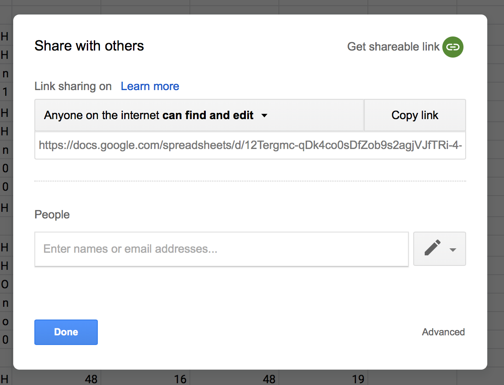

# Parama-roundup

This python script "rounds up" parametric axes values from Variable Font source files (in the designSpace/UFO format) and writes them to a Google Sheets spreadsheet.

| Arg | Description                                                            |
|-----|------------------------------------------------------------------------|
| -d  | Designspace filename                                                   |
| -i  | Spreadsheet ID for Input sheet (must contain “Index Refs” sheet        |
| -o  | Spreadsheet ID for Output sheet (if omitted, input sheet will be used) |

### Details

A source google sheet name and location will supply a design space file name and location. A column ID, containing a list of axes names, each with a glyph id and one or more glyph index points, and a units per em?

An axis with one index point value is to be measured in y from the index point to the origin. Positive and negative values should be returned.
An axis with two index point values measures the x or y distance as indicated by the first character of the axis name.

If you want to measure against the sidebearing or ascent/descent, phantom points are also accepted. These [are specified in the OpenType Spec](https://docs.microsoft.com/en-us/typography/opentype/spec/tt_instructing_glyphs#phantoms) and are defined as the following, given _n_ as the total number of points in the glyph:

* n = (origin, origin)
* n+1 = (advance width, origin)
* n+2 = (origin, ascender)
* n+3 = (origin, descender)

(Image from <https://docs.microsoft.com/en-us/typography/opentype/spec/images/ttinst_glyphs_02.png>)

A target google sheet name accepts a list of values for each ufo and instance in the design space, the values are written in columns with the style names to match the original axes list.

What can be used from there, currently consists of QA, writing true values for parametric axes to JavaScript, and for use by web programs.

Exporting, sheet to Designspace file, will be useful and specified, if roundup is comepleted.

### Quick Start

`buildSpreadsheet.py`

| Arg | Description                                                            |
|-----|------------------------------------------------------------------------|
| -d  | Designspace filename                                                   |
| -i  | Spreadsheet ID for Input sheet (must contain “Index Refs” sheet        |
| -o  | Spreadsheet ID for Output sheet (if omitted, input sheet will be used) |

### Usage Instructions

1. If this is your first time using the program, set up an authentication token. Run `quickstart.py` on the command line, following instructions to log in to your Google account. [Visit the APIv4 website for further instructions.](https://developers.google.com/sheets/api/quickstart/python))

    $ cd path/to/Parama-roundup
    $ python3 quickstart.py

2. Create a Google spreadsheet with a sheet tab called `Index Refs`, modeled on the [example sheet](https://docs.google.com/spreadsheets/d/1L1Cy2Y1JFOl32nuevTkzcxjNsSTlLGn_oiRLkMnyonY)

3. Click on “Share” in the upper right, and set spreadsheet permissions to “Anyone with the link can edit”

4. Record the Google Sheet ID for the sheet, which is the long sequence of letters and numbers found in the URL. For example, if the URL is <https://docs.google.com/spreadsheets/d/1L1Cy2Y1JFOl32nuevTkzcxjNsSTlLGn_oiRLkMnyonY/edit> then the ID is

    1L1Cy2Y1JFOl32nuevTkzcxjNsSTlLGn_oiRLkMnyonY

5. Run `buildSpreadsheet.py` on the command line.

    $ cd path/to/Parama-roundup
    $ python3 buildSpreadsheet.py -d **/path/to/MyDesignspace.designspace** -i **INPUT_GOOGLE_SHEET_ID**

6. If you want to output to a different Google Sheets file, you can simply pass an output arg with another sheet ID:

    $ python3 buildSpreadsheet.py -d **/path/to/MyDesignspace.designspace** -i **INPUT_GOOGLE_SHEET_ID** -o **OUTPUT_GOOGLE_SHEET_ID**

7. Check the output spreadsheet for `Axes`, `Measurements`, and `Widths` sheets with the resulting data

### Resource Summary

* [Example parametric VF project, Amstelvar](https://github.com/typenetwork/amstelvar/) 
* [Example designspace file](https://github.com/TypeNetwork/Amstelvar/blob/master/sources/Amstelvar-NewCharset/Amstelvar-Roman-010.designspace)
* [Example input sheet](https://docs.google.com/spreadsheets/d/1L1Cy2Y1JFOl32nuevTkzcxjNsSTlLGn_oiRLkMnyonY)

### License

Apache License 2.0
